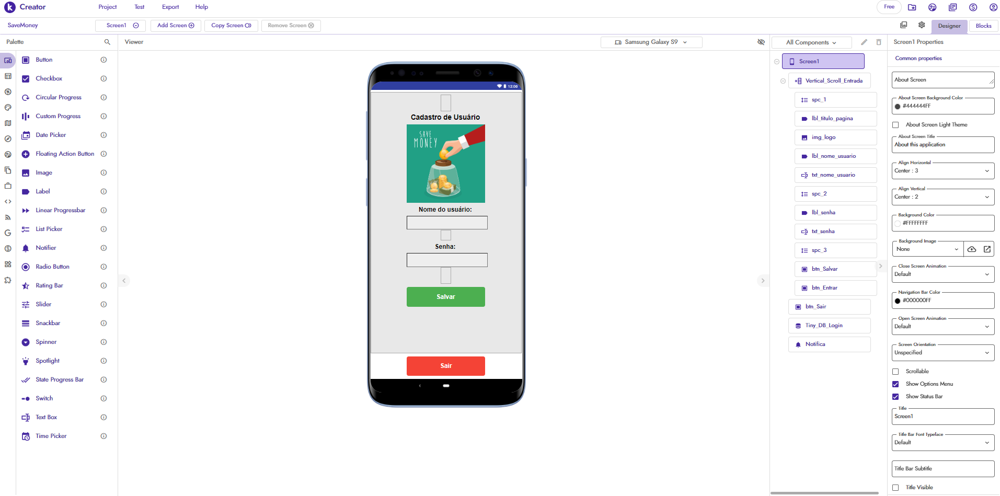
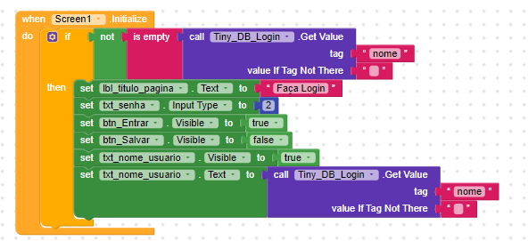
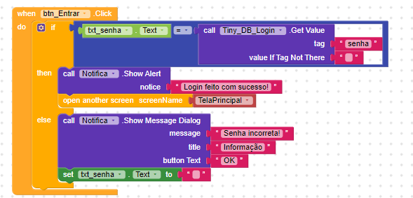
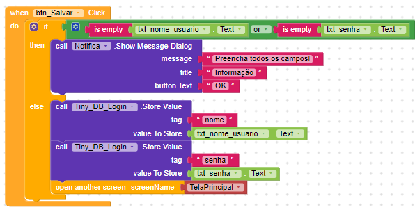
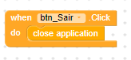

## Desenvolvimento da tela inicial

Criação da Screen 1 com a possibilidade de criar um cadastro e logar.

### Foram criados os componentes:

| Screen 1 | TELA DE LOGIN |
|---|---|
| Background Color | #444444FF |
| Align Horizontal | Center |
| Align Vertical | Center |
| Title Visible | Desabilitado |

| Vertical_Scroll_Entrada | TELA DE LOGIN ROLÁVEL |
|---|---|
| Align Horizontal | Center |
| Align Vertical | Top |
| Background Color | #00000000 |
| Height | Fill parent |
| Width | Fill parent |
| Scrollbar | Habilitado |
| Visible | Habilitado |

| spc_1 | ESPAÇO |
|---|---|
| Height | 40px |
| Width | Automático |

| spc_2 | ESPAÇO |
|---|---|
| Height | Automático |
| Width | Automático |

| spc_3 | ESPAÇO |
|---|---|
| Height | 40px |
| Width | Automático |

| lbl_titulo_pagina | LABEL COM O NOME DA PÁGINA |
|---|---|
| Background Color | #FFFFFF00 |
| Font Bold | Habilitado |
| Font Size | 20px |
| Height | Automático |
| Width | Automático |
| Text | Cadastro de usuário |
| Text Aligment | Center |
| Text Color |#000000FF |

| lbl_nome_usuario | LABEL COM O NOME DO USUÁRIO |
|---|---|
| Background Color | #FFFFFF00 |
| Font Bold | Habilitado |
| Font Size | 18px |
| Height | Automático |
| Width | Automático |
| Text | Nome do usuário |
| Text Aligment | Center |
| Text Color |#000000FF |

| lbl_senha | LABEL COM A SENHA DO USUÁRIO |
|---|---|
| Background Color | #FFFFFF00 |
| Font Bold | Habilitado |
| Font Size | 18px |
| Height | Automático |
| Width | Automático |
| Text | Senha:  |
| Text Aligment | Left |
| Text Color |#000000FF |

| img_logo | IMAGEM DO LOGO |
|---|---|
| Height | 200px |
| Width | Fill parent |
| Picture | logo.jpg |

| txt_nome_usuario | CAIXA DE TEXTO COM O NOME DO USUÁRIO |
|---|---|
| Background Color | #EEEEEEFF |
| Font Bold | Desabilitado |
| Font Size | 16px |
| Height | Automático |
| Width | 200px |
| Hint |   |
| Input type | Normal |
| Text Aligment | Center |
| Hint Color |#000000FF |

| txt_senha | CAIXA DE TEXTO COM A SENHA DO USUÁRIO |
|---|---|
| Background Color | #EEEEEEFF |
| Font Bold | Desabilitado |
| Font Size | 16px |
| Height | Automático |
| Width | 200px |
| Hint |   |
| Input type | Password |
| Text Aligment | Center |
| Hint Color |#000000FF |

| btn_Salvar | BOTÃO PARA SALVAR OS DADOS |
|---|---|
| Background Color | #4CAF50FF |
| Enabled | Habilitado |
| Font Bold | Habilitado |
| Font Size | 18px |
| Height | 50px |
| Width | 200px |
| Shape | Rounded |
| Text | Salvar  |
| Text Aligment | Center |
| Hint Color |#FFFFFFFF |

| btn_Entrar | BOTÃO PARA ENTRAR NO SISTEMA |
|---|---|
| Background Color | #4CAF50FF |
| Enabled | Habilitado |
| Font Bold | Habilitado |
| Font Size | 18px |
| Height | 50px |
| Width | 200px |
| Shape | Rounded |
| Text | Salvar  |
| Text Aligment | Center |
| Hint Color |#FFFFFFFF |
| Visible | Desabilitado |

| btn_Sair | BOTÃO PARA SAIR DA APLICAÇÃO |
|---|---|
| Background Color | #F44336FF |
| Enabled | Habilitado |
| Font Bold | Habilitado |
| Font Size | 18px |
| Height | 50px |
| Width | 200px |
| Shape | Rounded |
| Text | Sair  |
| Text Aligment | Center |
| Hint Color |#FFFFFFFF |

### <h4 style='color:green'> Não são vísiveis na tela </h4>

| Tiny_DB_Login | SISTEMA DE BANCO DE DADOS |
|---|---|
| Namespace | TinyDB1 |

| Notifica | NOTIFICA AVISOS NA TELA |
|---|---|
| __Não fiz nenhuma configuração aqui__ |

## Desenvolvimento da lógica de programação dos blocos

Quando inicializar o aplicativo, ele irá fazer uma condicional que irá verificar ser o campo nome não estiver vazio ele irá para mostrar no __lbl_titulo_pagina__ a frase "__Faça Login__". Mostrar o campo para inserir a senha com o input 2, que é password. Deixará o botão __Entrar__ vísivel e esconderá o __Salvar__. O nome do usuário que está salvo no banco de dados também estará visível. 

Dentro desse bloco temos uma condicional, quando a senha for inserida ela será validada pelo __Tiny_DB_Login__, caso esteja correta o usuário será notificado com a mensagem "__Login feito com sucesso__" e encaminhado para a __TelaPrincipal__.
Caso a senha esteja incorreta, será notificado com a mensagem:"__Senha incorreta!__" e o __txt_senha__ ficará em branco, para novamente o usuário inserir sua senha.

Aqui teremos a condicional que verifica se o nome do usuário ou a senha não estão em branco para cadastrar no banco de dados. Caso um dos componentes esteja vazio, o usuário é notificado com a mensagem: "__Preencha todos os campos!". Quando os campos forem preenchidos, o nome e a senha serão salvos e 
o usuário será encaminhado para a __Tela Principal__.

Neste bloco o botão __btn_Sair__ quando clicado irá fechar o aplicativo.
