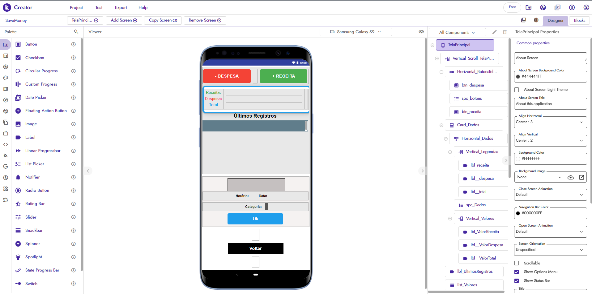
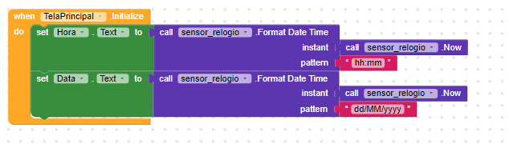
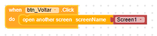

## Desenvolvimento da tela principal

Criação do designer da __TelaPrincipal__, aqui é onde ocorrerá a interação do usuário com o objetivo do aplicativo.

### Foram criados os componentes:

| TelaPrincipal | TELA DE AÇÃO DO APLICATIVO |
|---|---|
| Background Color | #444444FF |
| Align Horizontal | Center |
| Align Vertical | Center |
| Title Visible | Desabilitado |

| Vertical_Scroll_TelaPrincipal | ORGANIZAR OS ELEMENTOS NA TELA INTEIRA VERTICALMENTE |
|---|---|
|Align Horizontal |Center|
|Align Vertical |Center|
| Background Color | #00000000 |
| Height | Fill Parent |
| Width | Fill Parent |
| Scrollbar | Habilitado |
| Visible | Habilitado |

| Horizontal_BotoesTelaPrincipal | ORGANIZAR OS BOTÕES DE RECEITA E DESPESA NA TELA HORIZONTALMENTE |
|---|---|
|Align Horizontal | Center |
|Align Vertical | Top |
| Background Color | #00000000 |
| Height | Automático |
| Width | Fill Parent |
| Visible | Habilitado |

| btn_despesa | BOTÃO PARA INCLUIR DESPESA |
|---|---|
| Background Color | #F44336FF |
| Enabled | Habilitado |
| Font Bold | Habilitado |
| Font Size | 18px |
| Height | 50px |
| Width | Fill parent |
| Shape | Rounded |
| Text | - DESPESA  |
| Text Aligment | Center |
| Hint Color |#FFFFFFFF |

| spc_botoes | ESPAÇO |
|---|---|
| Height | 50px |
| Width | 15px |
| Visible | Habilitado |

| btn_receita | BOTÃO PARA INCLUIR RECEITA |
|---|---|
| Background Color | #4CAF50FF |
| Enabled | Habilitado |
| Font Bold | Habilitado |
| Font Size | 18px |
| Height | 50px |
| Width | Fill parent |
| Shape | Rounded |
| Text | + RECEITA  |
| Text Aligment | Center |
| Hint Color |#FFFFFFFF |

| Card_Dados | CARD PARA VISUALIZAÇÃO E INTERAÇÃO DO USUÁRIO COM OS DADOS DO APLICATIVO |
|---|---|
|Align Horizontal | Center |
|Align Vertical | Top |
| Background Color | #FFFFFFFF |
| Content Padding Bottom | 8 |
| Content Padding Left | 8 |
| Content Padding Right | 8 |
| Content Padding Top | 8 |
| Corner Radius | 10 |
| Elevation | 2 |
| Height | Automático |
| Width | Fill Parent |
| Stroke Color | #1E9EECFE |
| Stroke Width | 5 |
| Visible | Habilitado |

| Horizontal_Dados | ORGANIZAR AS LEGENDAS E OS VALORES NA TELA HORIZONTALMENTE |
|---|---|
|Align Horizontal | Left |
|Align Vertical | Center |
| Background Color | #00000000 |
| Height | Fill Parent  |
| Width | Fill Parent |
| Scrollbar | Desabilitado |
| Visible | Habilitado |

| Vertical_Legendas | ORGANIZAR AS LEGENDAS NA TELA VERTICALMENTE |
|---|---|
|Align Horizontal | Center |
|Align Vertical | Top |
| Background Color | #00000000 |
| Height | Automático  |
| Width | Automático |
| Scrollbar | Desabilitado |
| Visible | Habilitado |

| lbl_receita | LABEL COM A RECEITA DO USUÁRIO |
|---|---|
| Background Color | #FFFFFF00 |
| Font Bold | Habilitado |
| Font Size | 16px |
| Height | Automático |
| Width | Automático |
| Text | Receita:  |
| Text Aligment | Center |
| Text Color |#4CAF50FF |
| Visible | Habilitado |

| lbl_despesa | LABEL COM A DESPESA DO USUÁRIO |
|---|---|
| Background Color | #FFFFFF00 |
| Font Bold | Habilitado |
| Font Size | 16px |
| Height | Automático |
| Width | Automático |
| Text | Despesa:  |
| Text Aligment | Center |
| Text Color |#F44336FF |
| Visible | Habilitado |

| lbl_total | LABEL COM A TOTAL DO USUÁRIO |
|---|---|
| Background Color | #FFFFFF00 |
| Font Bold | Habilitado |
| Font Size | 16px |
| Height | Automático |
| Width | Automático |
| Text | Total:  |
| Text Aligment | Center |
| Text Color | #1E9EECFE |
| Visible | Habilitado |

| spc_Dados | ESPAÇO |
|---|---|
| Height | Automático |
| Width | Fill Parent |
| Visible | Habilitado |

| Vertical_Valores | ORGANIZAR OS VALORES NA TELA VERTICALMENTE |
|---|---|
|Align Horizontal | Center |
|Align Vertical | Top |
| Background Color | #00000000 |
| Height | Automático  |
| Width | Automático |
| Scrollbar | Desabilitado |
| Visible | Habilitado |

| lbl_ValorReceita | LABEL COM O VALOR DA RECEITA DO USUÁRIO |
|---|---|
| Background Color | #FFFFFF00 |
| Font Bold | Habilitado |
| Font Size | 16px |
| Height | Automático |
| Width | Automático |
| Text |  |
| Text Aligment | Center |
| Text Color |#4CAF50FF |
| Visible | Habilitado |

| lbl_ValorDespesa | LABEL COM O VALOR DA DESPESA DO USUÁRIO |
|---|---|
| Background Color | #FFFFFF00 |
| Font Bold | Habilitado |
| Font Size | 16px |
| Height | Automático |
| Width | Automático |
| Text |   |
| Text Aligment | Center |
| Text Color |#F44336FF |
| Visible | Habilitado |

| lbl_ValorTotal | LABEL COM O VALOR TOTAL DO USUÁRIO |
|---|---|
| Background Color | #FFFFFF00 |
| Font Bold | Habilitado |
| Font Size | 16px |
| Height | Automático |
| Width | Automático |
| Text |   |
| Text Aligment | Center |
| Text Color | #1E9EECFE |
| Visible | Habilitado |

| lbl_UltimosRegistros | LABEL COM O TÍTULO DA LISTA COM OS ÚLTIMOS REGISTROS DO USUÁRIO |
|---|---|
| Background Color | #FFFFFF00 |
| Font Bold | Habilitado |
| Font Size | 20px |
| Height | Automático |
| Width | Automático |
| Text |  Últimos Registros |
| Text Aligment | Center |
| Text Color | #000000FF |
| Visible | Habilitado |

| list_Valores | LISTA COM OS ÚLTIMOS REGISTROS DO USUÁRIO |
|---|---|
| Background Color | #607D8BFF |
| Heigth | Automático |
| Width | Fill Parent |
| Item Height in % | 10 |
| Scrolling Fading | Habilitado |
| Scrolling Speed | 1.0 |
| Search Text Color Color | #FFFFFFFF |
| Show Scrollbar | Habilitado |
| Text Alignment | Center |
| Text Color | #000000FF |
| Font Size | 18 |
| Visible | Habilitado |

| Vertical_DadosFinanceiros | ORGANIZAR OS DADOS FINANCEIROS NA TELA VERTICALMENTE |
|---|---|
|Align Horizontal | Center |
|Align Vertical | Top |
| Background Color | #F5F1F1FE |
| Height | Automático  |
| Width | Fill Parent |
| Visible | Habilitado |

| txt_valor | CAIXA DE TEXTO COM OS VALORES COLOCADOS PELO USUÁRIO |
|---|---|
| Background Color | #C5C0C0FE |
| Font Bold | Habilitado |
| Font Size | 18px |
| Height | 40px |
| Width | 200px |
| Hint | Valor  |
| Hint Color | #EEEEEEFF  |
| Input type | Normal |
| Text Aligment | Center |
| Hint Color |#000000FF |

| Horizontal_DataHora | ORGANIZAR OS DADOS DE DATA E HORA NA TELA HORIZONTALMENTE |
|---|---|
|Align Horizontal | Center |
|Align Vertical | Center |
| Background Color | #00000000 |
| Height | Fill Parent  |
| Width | Fill Parent |
| Visible | Habilitado |

| lbl_hora | LABEL COM O TEXTO DE REFERÊNCIA HORA |
|---|---|
| Background Color | #FFFFFF00 |
| Font Bold | Habilitado |
| Font Size | 14px |
| Height | Automático |
| Width | Automático |
| Text |  Horário: |
| Text Aligment | Left |
| Text Color | #000000FF |
| Visible | Habilitado |

| Hora | COMPONENTE PARA VISUALIZAR DATA E HORA |
|---|---|
| Background Color | #FFFFFF00 |
| Enabled | Habilitado |
| Font Size | 14px |
| Height | Automático |
| Width | Automático |
| Text |  |
| Text Aligment | Center |
| Text Color | #000000FF |
| Visible | Habilitado |

| lbl_data | LABEL COM O TEXTO DE REFERÊNCIA DATA |
|---|---|
| Background Color | #FFFFFF00 |
| Font Bold | Habilitado |
| Font Size | 14px |
| Height | Automático |
| Width | Automático |
| Text |  Data: |
| Text Aligment | Left |
| Text Color | #000000FF |
| Visible | Habilitado |

| Data | COMPONENTE PARA VISUALIZAR DATA E HORA |
|---|---|
| Background Color | #FFFFFF00 |
| Enabled | Habilitado |
| Font Size | 14px |
| Height | Automático |
| Width | Automático |
| Text |  |
| Text Aligment | Center |
| Text Color | #000000FF |
| Visible | Habilitado |

| Horizontal_Categoria | ORGANIZAR OS DADOS DE CATEGORIA NA TELA HORIZONTALMENTE |
|---|---|
|Align Horizontal | Center |
|Align Vertical | Center |
| Background Color | #00000000 |
| Height | Automático  |
| Width | Fill Parent |
| Visible | Habilitado |

| lbl_categoria | LABEL COM O TEXTO DE REFERÊNCIA CATEGORIA |
|---|---|
| Background Color | #FFFFFF00 |
| Font Bold | Habilitado |
| Font Size | 14px |
| Height | Automático |
| Width | Automático |
| Text |  Categoria: |
| Text Aligment | Center |
| Text Color | #000000FF |
| Visible | Habilitado |

| list_categoria | LISTA DE ITEMS COM AS CATEGORIAS DESPESA OU RECEITA PARA O VALOR |
|---|---|
| Background Color | #00000000 |
| Enabled | Habilitado |
| Font Size | 14px |
| Height | Automático |
| Width | 1px |
| Text |   |
| Text Aligment | Center |
| Text Color | #FFFFFF |
| Visible | Habilitado |

| btn_adicionarValor | BOTÃO PARA ENVIAR DADOS INSERIDOS PELO USUÁRIO |
|---|---|
| Background Color | #1E9EECFE |
| Enabled | Habilitado |
| Font Bold | Habilitado |
| Font Size | 16px |
| Height | 40px |
| Width | 200px |
| Shape | Rounded |
| Text | Ok  |
| Text Aligment | Center |
| Hint Color |#FFFFFFFF |
| Visible | Habilitado |

| spc_rodade1 | ESPAÇO |
|---|---|
| Height | 40px |
| Width | Automático |
| Visible | Habilitado |

| btn_Voltar | BOTÃO PARA RETORNAR PARA SCREEN1, TELA DE LOGIN |
|---|---|
| Background Color | #000000FF  |
| Enabled | Habilitado |
| Font Bold | Habilitado |
| Font Size | 18px |
| Height | 40px |
| Width | 200px |
| Shape | Rounded |
| Text | Voltar  |
| Text Aligment | Center |
| Hint Color |#FFFFFFFF |
| Visible | Habilitado |

| spc_rodade2 | ESPAÇO |
|---|---|
| Height | 40px |
| Width | Automático |
| Visible | Habilitado |

### <h4 style='color:green'> Não são vísiveis na tela </h4>

| sensor_relogio | SENSOR QUE PEGA A DATA E HORA DO APARELHO  |
|---|---|
| Timer Always Fires | Desabilitado |
| Timer Enabled | Desabilitado |
| Timer Interval | 1000 |

## Desenvolvimento da lógica de programação dos blocos

Dentro desse bloco chamamos o __sensor_relogio__ e formatamos a data e a hora para o formato brasileiro. Assim que a __TelaPrincipal__ for inicializada isso ocorrerá e atualizará o horário e a data do telefone móvel.

Ao clicar no botão o usuário será encaminhado para a página __Screen1__ onde está o login.