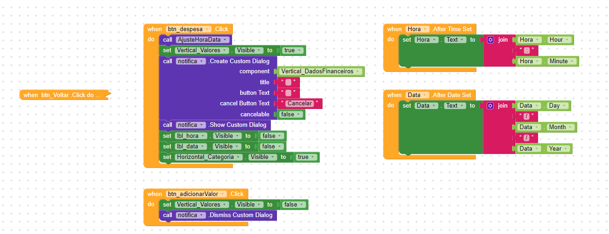

## Desenvolvimento da funções de hora, data e categoria no <spam style="color:red">botão despesa</spam>

Nessa parte desenvolvemos os ajustes de hora, data e categoria no btn_despesa.

### Os componentes incluídos e modificados:

| Horizontal_Categoria | ORGANIZAR OS DADOS DE CATEGORIA NA TELA HORIZONTALMENTE |
|---|---|
|Align Horizontal | Center |
|Align Vertical | Center |
| Background Color | #00000000 |
| Clickable | Habilitado |
| Height | Automático  |
| Width | Fill Parent |
| Visible | Desabilitado |

| lbl_categoria | LABEL COM O TEXTO DE REFERÊNCIA CATEGORIA |
|---|---|
| Background Color | #FFFFFF00 |
| Clickable | Habilitado |
| Font Bold | Habilitado |
| Font Size | 14px |
| Height | Automático |
| Width | Automático |
| Text |  categoria |
| Text Aligment | Center |
| Text Color | #000000FF |
| Visible | Habilitado |

| spc_categoria | ESPAÇO |
|---|---|
| Height | Automático |
| Width | 10px |
| Visible | Habilitado |

| list_categoria | LISTA DE ITEMS COM AS CATEGORIAS DESPESA OU RECEITA PARA O VALOR |
|---|---|
| Background Color | #FFFFFF00 |
| Elements from String | Casa, Trabalho, Entretenimento, Transporte, Banco |
| Enabled | Habilitado |
| Font Size | 14px |
| Height | Automático |
| Width | Automático |
| Selection | Categoria  |
| Text |  ▼ |
| Text Aligment | Center |
| Text Color | #FFFFFF |
| Visible | Habilitado |

### <h4 style='color:green'> Não são vísiveis na tela </h4>

| notifica | COMPONENTE RESPONSÁVEL POR NOTIFICAÇÕES PARA O USUÁRIO |
|---|---|
|  | Não foi modificado nada neste componente |

## Desenvolvimento da lógica de programação dos blocos

Criamos aqui um procedimento de ação, que quando precisar atualizar o horário e a data para ficar igual ao do aparelho, iremos chamar essa ação.
Substituimos os blocos que foram inseridos inicialmente no inicializar __TelaPrincipal__ para a função __AjusteHoraData__.

Aqui inserimos as primeiras funcionalidades do botão __btn_despesa__. Quando ele for acionado ele irá chamar o elemento de notificação, que mostrará o bloco de componentes __Vertical_DadosFinanceiros__, onde foi optado por deixar o texto __Cancelar__ para caso o usuário queira voltar sem salvar nada e as outras opções foram desligadas e deixadas vazias. Nesse espaço aparecerá a o campo para inserir o valor, a hora, a data e a categoria do valor, sendo que desativamos as legendas __data__ e __hora__ por ser intuitivo e um visual mais limpo para o usuário.

Quando o usuário sair da tela de visualizar a inserção da despesa, clicando no __btn_adicionarValor__ e sendo enviado de volta para a tela inicial ele não verá mais a opção __Vertical_Valores__.

A hora e a data poderão ser selecionados pelo usuário, por isso os blocos estão chamando a __Data__ e __Hora__ e escrevendo o valor que o usuário escolher por cima do valor anterior.

Já nesses últimos blocos, quando o __Horizontal_Categoria__ e o texto do __lbl_categoria__ forem clicados ele abrirá a lista de categorias.

Essa lista pegará o valor selecionado e escreverá ele para visualização do usuário no __lbl_categoria__.
