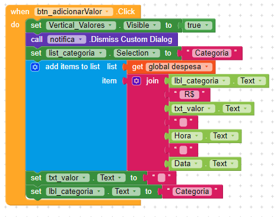

## Desenvolvimento do Botão <spam style="color:red"> Despesa </spam>

Desenvolvimento de salvar valores do botão __Despesa__ e apresentar a lista para o usuário.

### Tela 1
|

### Tela 2

### Tela 3

### Os componentes incluídos e modificados:

| list_categoria | LISTA DE ITEMS COM AS CATEGORIAS DESPESA OU RECEITA PARA O VALOR |
|---|---|
| Elements from String | <spam style='color:green'> Categoria,</spam> Casa, Trabalho, Entretenimento, Transporte, Banco |

| btn_Voltar | COMPONENTE RESPONSÁVEL PELA SAÍDA DA TELA PRINCIPAL PARA A TELA SCREEN1 |
|---|---|
| Text | Logout |

| list_Valores | LISTA COM OS ÚLTIMOS REGISTROS DO USUÁRIO |
|---|---|
| Item Height in % | 5 |
| Text Alignment | Left |
| Font Size | 14 |

_**Mudança do texto para ser mais intuitivo para o usuário sair da aplicação.**_

### <h4 style='color:green'> Não são vísiveis na tela </h4>

| Tiny_DB1 | COMPONENTE RESPONSÁVEL PELO BANCO DE DADOS |
|---|---|
|  | Não foi modificado nada neste componente |

## Desenvolvimento da lógica de programação dos blocos

Aqui inserimos o espaço vazio e a opção __Categoria__ para que o usuário sempre quando entrar na despesa poder preencher novamente o que deseja, sem ficar os dados anteriores aparecendo. Optamos por substituir o texto da categoria selecionado por __Categoria__ sempre que o __btn_adicionarValor__ for clicado.

Iremos criar uma variável chamada __despesa__ que criará uma lista vazia.

Agora vamos pegar o componente de adicionar itens a lista, que colocará o valor da variável __despesa__ que o usuário inseriu no __txt_Valor__ e mostrará a categoria, o R$ valor, hora e data que estão armazenados no __Tiny_DB1__. Os set de __txt_valor__ e __lbl_categoria__ estão por último para não excluir os valores antes de salvar, quando tudo for incluído no banco, depois apaga tudo e retorna limpo para o usuário inserir os dados novamente.

Criamos uma função com o nome __atualizarValores__ que vai ser sempre chamada quando iniciar a tela principal. Ela pega o valor do banco de dados e coloca a função no __lbl__ValorDespesa__.

Dentro do bloco __TelaPrincipal__ irá fazer uma verificação que se não estiver vazio o nosso banco de dados ele irá ajustar a variável __global despesa__ e por último chamar a função __atualizarValores__.

Aqui já incluimos o bloco do banco de dados que chamará os valores e somará com o __txt_valor__ inserido pelo usuário. Usamos outro nome para o banco de dado armazenar __valorDespesa__ separado do outro valor guardado __despesa__.

Colocamos os valores para testar da __global despesa__ na __list_Valores__. 
Obs.: Isso é apenas provisório, pois nesse bloco apresentaremos a receita e a despesa. Isso é apenas um teste.

Para finalizar esse bloco por enquanto colocamos uma condição para verificar se o campo __txt_valor__ está vazio e se a categoria foi selecionada, caso a __lbl_categoria__ seja diferente de __categoria__ significa que foi selecionada. Caso os campos não estejam correspondentes a condição uma mensagem de erro será apresentada ao usuário. A mensagem de erro que pode aparecer sem essa condicional está no final desse documento.

Aqui já atualizamos os valores da __Horizontal_Dados__, onde o valor total é a receita menos a despesa e a receita como ainda não foi feita está com o valor 0.

E agora por fim, ao inicializar a tela principal será chamado os componentes do __list_Valores__, o procedimento que atualizará os dados __atualizarValores__ e os dados do banco de dados.

### Mensagens de erro apresentadas durante o desenvolvimento

Alteramos o __txt_valor__ para que ele não pegasse o resultado em branco nos retornando o erro:

_The operation + cannot accept the arguments, [0], [*empty-string*]_.
---
Que significa que a operação não pode aceitar a soma de um texto vazio com o zero, pois o que foi colocado pelo usuário foi deletado antes de salvar.

