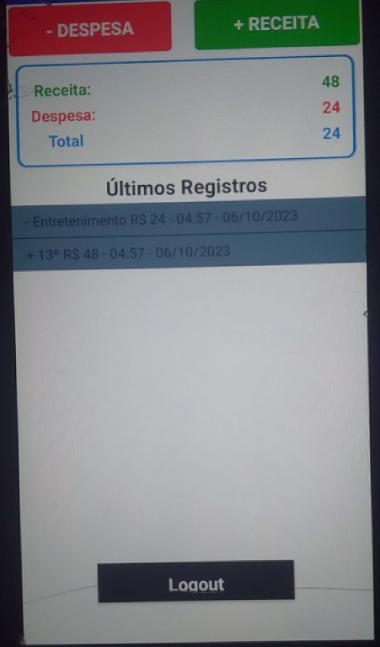

## Desenvolvimento do <spam style="color:green">botão receita</spam>

Iremos desenvolver nesse bloco a inclusão da funcionalidade do btn_receita e alterar algumas nomenclaturas.

 Foram criados e modificados os componentes:

Nesse caso fizemos uma duplicada do __Vertical_despesa__ e modificamos a nomenclatura para não ocasionar erros na hora de selecionar o componente de cada um.

| list_categoria_despesa | LISTA DE ITEMS COM AS CATEGORIAS DESPESA OU RECEITA PARA O VALOR |
|---|---|
| Background Color | #00000000 |
| Elements from String | Categoria, Casa, Trabalho, Entretenimento, Transporte, Banco |
| Enabled | Habilitado |
| Font Size | 14px |
| Height | Automático |
| Width | 1px |
| Text |   |
| Text Aligment | Center |
| Text Color | #FFFFFF |
| Visible | Habilitado |

| list_categoria_receita | LISTA DE ITEMS COM AS CATEGORIAS DESPESA OU RECEITA PARA O VALOR |
|---|---|
| Background Color | #00000000 |
| Elements from String | Categoria, Salário, 13º , Extra |
| Enabled | Habilitado |
| Font Size | 14px |
| Height | Automático |
| Width | 1px |
| Text |   |
| Text Aligment | Center |
| Text Color | #FFFFFF |
| Visible | Habilitado |

### <h4 style='color:green'> Não são vísiveis na tela </h4>

| aaaaaaaa | AAAAAAA |
|---|---|
|aaaaa | aaaaa |

## Desenvolvimento da lógica de programação dos blocos

Para criação da receita duplicamos todos os elementos da __Vertical_despesa__ e substituimos o nome __despesa__ por __receita__.

Aqui incluimos os blocos da receita junto com o da despesa.

Criamos uma nova lista para receber os valores de receita e despesa e apresentar para o usuário.

Criamos esses blocos para inserir na despesa e na receita.

Depois chamamos no __list_Valores__.

Colocamos o __ValorTotal__ para aparecer na tela a receita e a despesa para o usuário.
O bloco __ClearAll__ está desabilitado pois ele só estava sendo usado para testar o programa.

E para mostrar o que é despesa e o que é receita nesse primeiro momento inserimos um + e um - no texto.

No final dessa parte o programa ficou assim:
