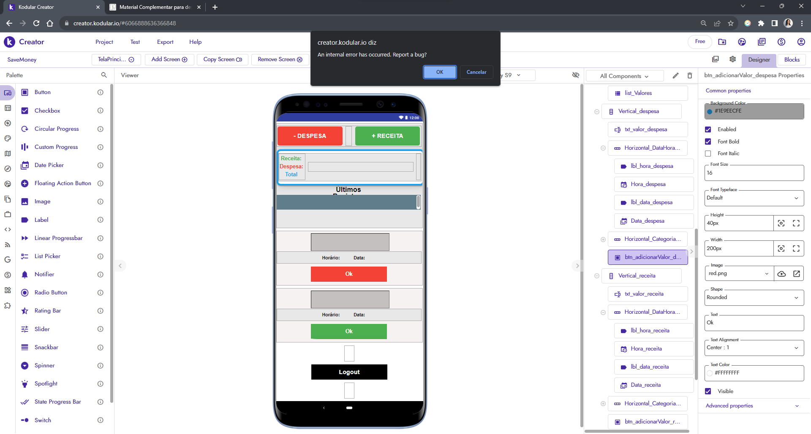

# Apagar um item da lista
eeeee

### Foram criados e modificados os componentes:

| spc_valores | ESPAÇO |
|---|---|
|Height | 10px |
|Width | Automático |

## Desenvolvimento da lógica de programação dos blocos

img

text

## Modificação por causa de erro interno da plataforma

A plataforma não estava aceitando modificação de cor dos botões e para ser mais intuitivo para o usuário seria interessante que o botão correspondente a despesa fosse vermelho e o da receita fosse verde. Por isso inclui duas imagens correspondente a cor para colocar como background.
	
| btn_adicionarValor_despesa | BOTÃO PARA ENVIAR DADOS INSERIDOS PELO USUÁRIO DA DESPESA|
|---|---|
|Image | red.png |

| btn_adicionarValor_receita | BOTÃO PARA ENVIAR DADOS INSERIDOS PELO USUÁRIO DA RECEITA |
|---|---|
|Image | green.png |

